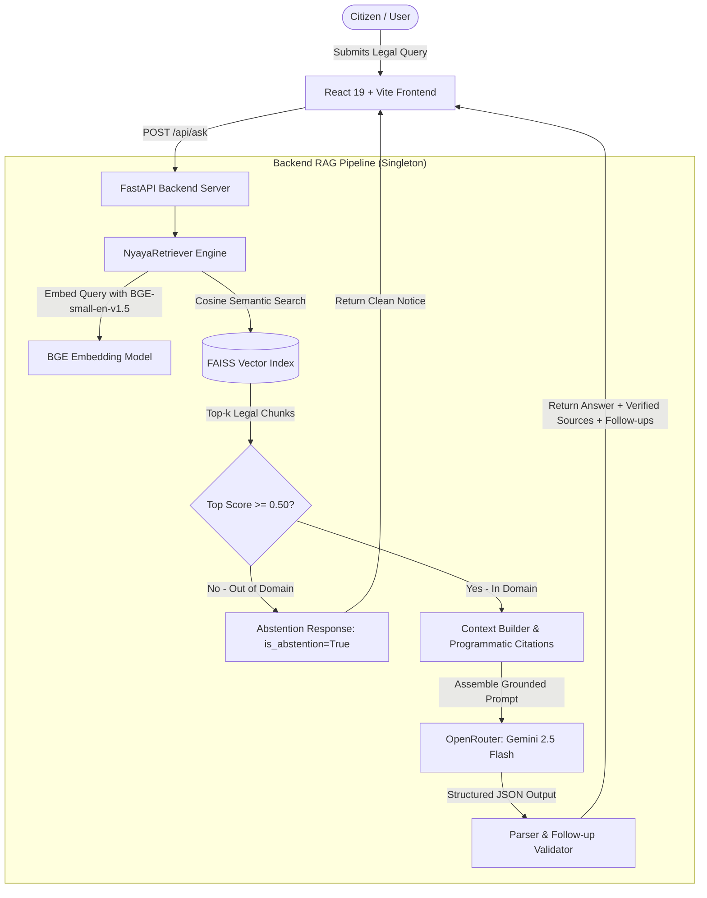

# NyayaGuide AI — Official Civic Rights Knowledge Base

NyayaGuide AI is a source-grounded civic and legal rights assistant designed for Indian citizens. It utilizes **Retrieval-Augmented Generation (RAG)** over authentic Government of India statutory acts, gazettes, and rules to provide verified, citizen-friendly guidance on **Right to Information (RTI)** and **Consumer Protection**.

---

## 1. Problem Statement & Motivation
Legal statutes in India are frequently published in dense, formal legal prose across lengthy gazettes and bare acts. Citizens seeking essential public services—such as filing an RTI query or submitting a consumer grievance against defective goods—face significant friction navigating complex sections, rules, and procedures.

**NyayaGuide AI** bridges this gap:
- Answers queries using **strictly grounded source context** rather than raw LLM training memorization.
- Programmatically extracts and displays **verifiable statutory citations** (Act title, section/rule, page number, and issuing authority).
- Provides **contextually relevant follow-up questions** to guide the citizen's legal inquiry journey.
- Implements strict **abstention guardrails** to reject out-of-domain, non-civic questions without hallucinating legal facts.

---

## 2. Key Features
- **Strict Grounding & Zero Hallucination Guardrails**: 13 strict rules prevent the invention of legal sections, timelines, filing fees, or procedures.
- **Programmatic Citation Verification**: Citations are generated from verified FAISS chunk metadata, not synthesized by the LLM.
- **Grounded Follow-up Suggestions**: Generates 3–4 relevant follow-up questions in a single generation step based exclusively on the retrieved legal context.
- **Abstention Mechanism**: Employs an exact cosine similarity threshold ($\ge 0.50$) to reject out-of-scope questions without invoking the LLM.
- **Enterprise-Grade Architecture**: Reusable singleton RAG pipeline with FastAPI backend and responsive React 19 + TypeScript frontend.
- **Zero Secrets Exposure**: API keys and tokens are securely isolated in environment variables on the backend and never exposed to the client.

---

## 3. Supported Legal Knowledge Base
The knowledge base currently indexes four official Government of India publications:
1. **The Right to Information Act, 2005** (`RTI_Act_2005.pdf`, Ministry of Law & Justice)
2. **The Right to Information Rules, 2012** (`RTI_Rules_2012.pdf`, Department of Personnel & Training)
3. **The Consumer Protection Act, 2019** (`Consumer_Protection_Act_2019.pdf`, Ministry of Law & Justice)
4. **The Consumer Protection (Consumer Commission Procedure) and General Rules, 2020** (`Consumer_Commission_and_General_Rules_2020.pdf`, Department of Consumer Affairs)

- **Total Extracted Pages**: 89 pages
- **Total Legal Chunks**: 96 chunks with structural legal reference detection (`Section`, `Rule`, `Chapter`)
- **Embedding Model**: `BAAI/bge-small-en-v1.5` (384 dimensions, L2-normalized)
- **Vector Index**: FAISS `IndexFlatIP` (Exact Inner Product $\equiv$ Cosine Similarity)

---

## 4. System Architecture & RAG Workflow



---

## 5. Project Directory Structure

```
nyayaguide_knowledge_base/
├── backend/
│   ├── app/
│   │   ├── api/
│   │   │   ├── app.py           # FastAPI app, CORS, lifespan singleton pipeline
│   │   │   ├── routes.py        # /health and /api/ask routes
│   │   │   └── schemas.py       # Pydantic request/response schemas
│   │   ├── ingestion/           # PDF extraction, cleaning, and chunking
│   │   ├── llm/                 # OpenRouter LLM client with credential masking
│   │   ├── models/              # Pydantic data structures
│   │   ├── rag/                 # RAG pipeline, context builder, grounding prompt
│   │   ├── retrieval/           # BGE embeddings, FAISS vector store, retriever
│   │   └── config.py            # Central environment configuration
│   ├── data/
│   │   └── vector_store/        # FAISS index (faiss_index.bin) & chunk metadata
│   └── tests/                   # 61 unit, retrieval, pipeline, and API tests
│
├── frontend/
│   ├── src/
│   │   ├── components/          # Header, QuestionInput, SourceCard, FollowUpQuestions, etc.
│   │   ├── services/            # Centralized API service
│   │   ├── types/               # TypeScript interfaces
│   │   ├── styles/              # Civic legal CSS stylesheet
│   │   ├── App.tsx              # Main interactive session timeline
│   │   └── main.tsx             # React DOM root
│   ├── index.html
│   ├── package.json
│   └── vite.config.ts           # Development proxy & server config
│
├── metadata/                    # Official document registry
├── .env.example                 # Safe environment variable template
├── .gitignore                   # Excludes secrets, cache, and build files
└── README.md                    # Complete project documentation
```

---

## 6. Environment Configuration

Copy `.env.example` to `.env` in the project root:

```bash
cp .env.example .env
```

Set the following variables in `.env`:

| Variable | Description | Required | Default / Example |
|---|---|---|---|
| `OPENROUTER_API_KEY` | OpenRouter API Key for Gemini 2.5 Flash | Yes | `sk-or-v1-...` |
| `OPENROUTER_MODEL` | Grounding LLM model | No | `google/gemini-2.5-flash` |
| `HF_TOKEN` | Hugging Face token for source dataset | Optional | `hf_...` |
| `CORS_ALLOWED_ORIGINS` | Comma-separated allowed frontend origins | No | `http://localhost:3000,http://localhost:5173` |
| `MIN_RELEVANCE_THRESHOLD` | Cosine relevance threshold for abstention | No | `0.50` |
| `MAX_QUESTION_LENGTH` | Maximum allowed character length for questions | No | `2000` |

---

## 7. Installation & Setup

### Prerequisites
- Python 3.10+
- Node.js 18+ and npm

### Backend Setup
```bash
# Install Python dependencies
pip install -r requirements.txt   # or: pip install fastapi uvicorn pydantic sentence-transformers faiss-cpu python-dotenv httpx
```

### Frontend Setup
```bash
cd frontend
npm install
```

---

## 8. Running the Application

### 1. Start the Backend API (Terminal 1)
```bash
python -m uvicorn backend.app.api.app:app --host 127.0.0.1 --port 8000 --reload
```
- **Backend API**: `http://localhost:8000`
- **Interactive Swagger Documentation**: `http://localhost:8000/docs`
- **OpenAPI Schema**: `http://localhost:8000/openapi.json`

### 2. Start the Frontend (Terminal 2)
```bash
cd frontend
npm run dev
```
- **Frontend UI**: `http://localhost:5173`

---

## 9. API Reference

### `GET /health`
Returns system status without loading heavy components or invoking LLMs.
```json
{
  "status": "ok"
}
```

### `POST /api/ask`
Executes end-to-end grounded legal RAG query.

**Request:**
```json
{
  "question": "How can I file an RTI application?"
}
```

**Response:**
```json
{
  "question": "How can I file an RTI application?",
  "answer": "To file an RTI application, a citizen can submit a written or electronic request to the Central Public Information Officer (CPIO) or State Public Information Officer (SPIO)... [SOURCE 1, Section 6].",
  "sources": [
    {
      "document": "RTI_Act_2005.pdf",
      "category": "RTI",
      "page": 6,
      "legal_reference": "Section 6",
      "title": "The Right to Information Act, 2005",
      "source": "India Code",
      "source_url": "https://cic.gov.in",
      "chunk_id": "RTI_Act_2005_p6_c1"
    }
  ],
  "is_abstention": false,
  "model_used": "google/gemini-2.5-flash",
  "top_score": 0.5388,
  "follow_up_questions": [
    "What is the fee for an RTI application?",
    "What is the time limit for a PIO to respond?",
    "What can I do if my RTI request is rejected?"
  ]
}
```

---

## 10. Automated Test Suite

To run all 61 automated regression and unit tests:
```bash
python -m unittest discover -s backend/tests -p "test_*.py" -v
```

---

## 11. Security Audit & Best Practices
- **No Client Secrets**: The browser communicates only with `/api/ask`. No API keys or tokens exist in frontend code or bundles.
- **Sanitized Server Logs**: All exception logs pass through regular-expression masking to redact keys before writing to server logs.
- **Git Protection**: `.env`, `node_modules/`, and vector storage binaries are excluded from source control.

---

## 12. Known Limitations & Disclaimer
- **Knowledge Base Scope**: NyayaGuide AI is strictly bounded to the 4 Government of India Acts & Rules currently indexed (RTI Act 2005, RTI Rules 2012, CPA 2019, Consumer Rules 2020). It does not cover other branches of Indian law (such as criminal, property, or family law).
- **Not Legal Counsel**: NyayaGuide AI provides source-grounded legal and civic information for educational and public empowerment purposes. It is not a lawyer and does not offer formal legal representation or advice.
- **Statutory Updates**: Acts and statutory fees may be amended over time. Users should consult the official Gazette of India or relevant statutory authorities for the latest notices.
